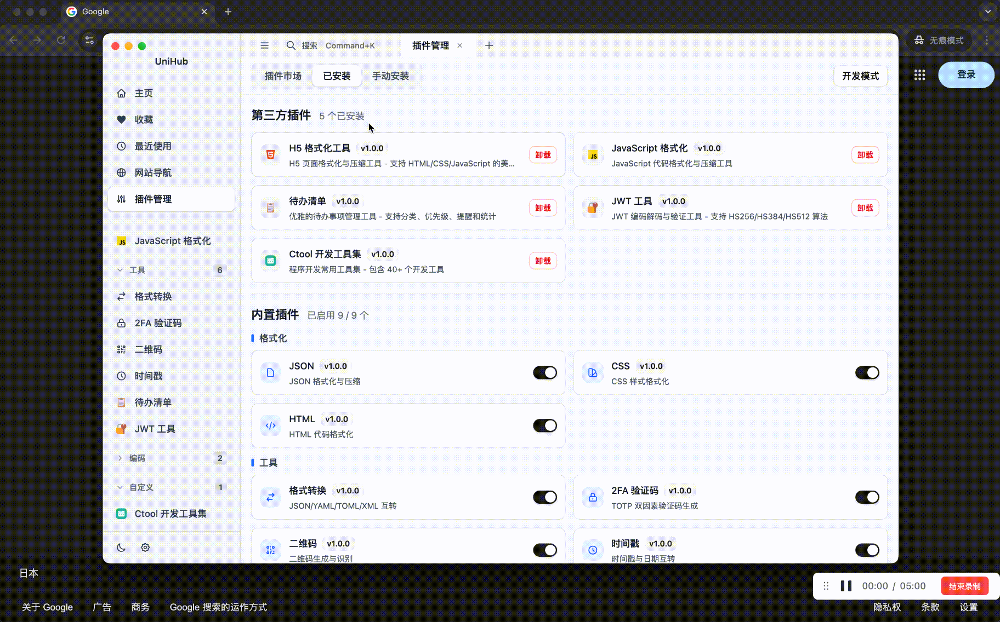

<h1 align="center">UniHub</h1>

<p align="center">
  
  
  
  
  
</p>

<p align="center">
  <a href="https://github.com/t8y2/unihub/stargazers">
    
  </a>
  <a href="https://github.com/t8y2/unihub/network/members">
    
  </a>
  <a href="https://github.com/t8y2/unihub/issues">
    
  </a>
</p>

<p align="center">
  <a href="./README.en.md">English</a> | 简体中文
</p>

一个基于 Electron 的现代化工具集应用，支持强大的插件系统。

## 📸 预览

<p align="center">
  
</p>

## 💬 交流群

欢迎加入 UniHub 交流群，与其他开发者一起讨论和分享！

<table>
  <tr>
    <td align="center">
      
      <p><strong>微信交流群</strong></p>
    </td>
    <td align="center">
      
      <p><strong>QQ 交流群</strong></p>
    </td>
  </tr>
</table>

## 特性

- 🔌 强大的插件系统 - 支持动态加载和管理插件
- 🎨 现代化 UI - 基于 Vue 3 + Tailwind CSS
- 🚀 高性能 - 使用 Vite 构建
- 📦 插件市场 - 内置插件市场，一键安装
- 🔒 权限管理 - 细粒度的插件权限控制
- 🔄 自动检测更新 - 支持应用自动更新，基于 GitHub Releases

## 快速开始

```bash
# 安装依赖
pnpm install

# 开发模式
pnpm dev

# 构建应用
pnpm build              # 所有平台
pnpm build:mac          # macOS
pnpm build:win          # Windows
pnpm build:linux        # Linux
```

## 插件开发

使用官方 CLI 工具快速开发插件：

```bash
# 安装 CLI
npm install -g @unihubjs/plugin-cli

# 创建插件（支持 simple/vue/react 模板）
uhp create my-plugin

# 开发
cd my-plugin && npm install
uhp dev

# 打包
uhp package
```

生成的 `plugin.zip` 可直接拖拽到 UniHub 安装，或提交 PR 到 `marketplace/plugins.json` 发布到插件市场。

查看完整文档：[Plugin CLI](tools/plugin-cli/README.md) | 示例插件：[examples/](examples/)

## 快捷键

| 功能       | macOS         | Windows/Linux     |
| ---------- | ------------- | ----------------- |
| 全局搜索   | <kbd>⌘K</kbd> | <kbd>Ctrl+K</kbd> |
| 新建标签   | <kbd>⌘N</kbd> | <kbd>Ctrl+N</kbd> |
| 关闭标签   | <kbd>⌘W</kbd> | <kbd>Ctrl+W</kbd> |
| 切换侧边栏 | <kbd>⌘B</kbd> | <kbd>Ctrl+B</kbd> |

## 技术栈

- Electron
- Vue 3
- TypeScript
- Vite
- Tailwind CSS
- reka-ui

## 许可证

MIT
